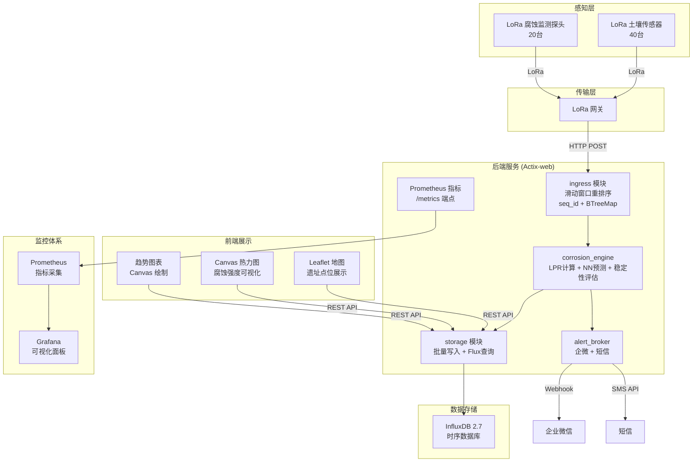

# 宋代战地医院遗址微环境与出土医疗器具腐蚀监测系统

> Ancient Battlefield Hospital Site Microenvironment and Excavated Medical Artifacts Corrosion Monitoring System

## 目录

- [项目简介](#项目简介)
- [系统架构](#系统架构)
- [目录结构](#目录结构)
- [核心功能](#核心功能)
- [快速部署](#快速部署)
- [本地开发](#本地开发)
- [API 文档](#api-文档)
- [模拟器配置](#模拟器配置)
- [配置说明](#配置说明)
- [技术栈](#技术栈)
- [许可证](#许可证)

---

## 项目简介

本系统是为 **2000㎡ 宋代战地医院遗址** 设计的文物腐蚀监测平台，旨在通过物联网传感技术实时监测遗址微环境参数与出土医疗器具的腐蚀状态，为文物保护提供科学依据。

### 监测规模

| 类别 | 数量 | 说明 |
|------|------|------|
| 土壤温湿度/pH/氯离子传感器 | 40 台 | 多点位土壤环境监测 |
| 金属腐蚀监测探头 | 20 台 | 铁器/铜器腐蚀速率监测 |
| 监测区域 | 6 个 | 主营区、药房区、伤兵区、器械库、手术区、外围 |

### 核心能力

- **实时数据采集**：每 30 分钟通过 LoRa 网关上报一次监测数据
- **腐蚀速率计算**：基于线性极化电阻法（LPR）精确计算金属腐蚀速率
- **智能预测预警**：神经网络模型预测未来 7/30/90 天腐蚀趋势
- **稳定性评估**：铁器/铜器 5 级稳定性评估体系，附保护建议
- **多通道告警**：企业微信 Webhook + 短信双通道告警通知
- **数据降采样**：InfluxDB 三级保留策略（1m/1h/1d），长期数据存储

---

## 系统架构



### 后端模块说明

| 模块 | 职责 | 关键技术 |
|------|------|----------|
| `ingress` | LoRa 数据接入与重排序 | BTreeMap 滑动窗口、seq_id 去重、15s 超时过期 |
| `corrosion_engine` | 腐蚀速率计算与预测 | LPR 公式、神经网络（Dropout+L2）、5级稳定性评估 |
| `storage` | 时序数据读写 | InfluxDB 2.x、批量写入（50条/1s）、Flux 查询 |
| `alert_broker` | 告警分发与冷却 | 阈值检测、冷却去重、企业微信 Markdown、短信占位 |
| `common` | 通用模型与配置 | Serde 序列化、TOML 配置、错误类型 |

---

## 目录结构

```
AI_solo_coder_task_A_048/
├── backend/                          # 后端服务 (Rust + Actix-web)
│   ├── src/
│   │   ├── main.rs                   # 服务入口，路由注册
│   │   ├── common/                   # 通用模块
│   │   │   ├── mod.rs
│   │   │   ├── config.rs             # TOML 配置加载
│   │   │   ├── error.rs              # 错误类型定义
│   │   │   └── models.rs             # 数据模型 + 设备点位生成
│   │   ├── ingress/                  # LoRa 数据接入层
│   │   │   ├── mod.rs
│   │   │   ├── gateway.rs            # 滑动窗口重排序 (BTreeMap)
│   │   │   └── handler.rs            # HTTP 处理器
│   │   ├── corrosion_engine/         # 腐蚀分析引擎
│   │   │   ├── mod.rs
│   │   │   ├── lpr.rs                # 线性极化电阻法计算
│   │   │   ├── predictor.rs          # 神经网络腐蚀预测
│   │   │   └── stability.rs          # 稳定性评估与保护建议
│   │   ├── storage/                  # 数据存储层
│   │   │   ├── mod.rs
│   │   │   ├── writer.rs             # 批量异步写入
│   │   │   └── reader.rs             # Flux 查询
│   │   └── alert_broker/             # 告警服务
│   │       ├── mod.rs
│   │       └── service.rs            # 企微 + 短信告警
│   ├── Cargo.toml
│   ├── config.toml                   # 主配置文件
│   ├── .env.example
│   └── Dockerfile
├── frontend/                         # 前端页面 (原生 JS)
│   ├── index.html                    # 主页面
│   ├── css/
│   │   └── style.css                 # 样式文件
│   └── js/
│       ├── app.js                    # 应用主逻辑
│       ├── MapView.js                # Leaflet 地图 + Canvas 热力图
│       └── CorrosionPanel.js         # 腐蚀详情面板 + 趋势图
├── lora-simulator/                   # LoRa 数据模拟器
│   ├── src/main.rs
│   ├── Cargo.toml
│   └── Dockerfile
├── influxdb/                         # InfluxDB 初始化
│   ├── init.iql                      # 保留策略 + 连续查询
│   └── docker-compose.yml
├── nginx/                            # Nginx 配置
│   ├── nginx.conf
│   ├── nginx.conf.template
│   └── Dockerfile.simple
├── prometheus/                       # Prometheus 监控
│   └── prometheus.yml                # (需自行配置)
├── docker-compose.yml                # 一键部署编排
├── Dockerfile.nginx
└── README.md
```

---

## 核心功能

### 1. LoRa 网关滑动窗口重排序

针对 LoRa 传输可能出现的数据包乱序问题，采用 **BTreeMap + 滑动窗口** 机制实现数据包重排序：

- **seq_id 跟踪**：每个设备维护独立的预期序列号
- **BTreeMap 缓冲**：按序列号有序存储乱序到达的数据包
- **顺序释放**：当预期序列号的数据包到达时，连续释放已就绪的数据包
- **超时过期**：超过 15 秒未补齐的包，强制释放并告警
- **窗口溢出保护**：窗口超过 100 个包时强制清空重置

```rust
// 核心数据结构
struct DeviceWindow {
    device_id: String,
    expected_seq: u64,      // 下一个预期序列号
    buffer: BTreeMap<u64, BufferedPacket>,  // 有序缓冲
    highest_seq: u64,
    lowest_seq: u64,
}
```

### 2. 线性极化电阻法 (LPR) 腐蚀速率计算

基于 Stern-Geary 方程，通过极化电阻计算腐蚀电流密度，再换算为腐蚀速率（mm/年）：

```
腐蚀速率 (mm/y) = (3.27e-3 × Icorr × M × t) / (n × F × ρ × 1e-3)
```

支持 **铁器** 和 **铜器** 两种材质的参数适配：

| 参数 | 铁器 | 铜器 |
|------|------|------|
| 密度 ρ | 7.87 g/cm³ | 8.96 g/cm³ |
| 原子量 M | 55.85 g/mol | 63.55 g/mol |
| 价态 n | 2.0 | 2.0 |
| Tafel 斜率 B | 26 mV | 26 mV |

### 3. 神经网络腐蚀预测

采用 **单隐藏层神经网络** 预测腐蚀速率发展趋势：

- **输入特征**（6维）：温度、湿度、pH、氯离子、材质因子、当前速率
- **隐藏层**：8 个神经元，tanh 激活，He 初始化
- **输出**：环境加速因子（sigmoid × 1.5）
- **正则化**：
  - Dropout (rate=0.2)：训练时随机失活神经元
  - L2 正则化 (λ=0.001)：权重衰减防止过拟合
  - 早停机制（Early Stopping）

预测输出包含 7 天、30 天、90 天的腐蚀速率预测值及风险等级（低/中/较高/高）。

### 4. 铁器/铜器稳定性 5 级评估

综合环境因素与腐蚀速率，计算稳定性指数（0~1），对应 5 个等级：

| 等级 | 稳定性指数 | 说明 |
|------|-----------|------|
| 极稳定 | > 0.85 | 环境良好，腐蚀极微 |
| 稳定 | 0.7 ~ 0.85 | 环境适宜，腐蚀缓慢 |
| 较稳定 | 0.5 ~ 0.7 | 环境一般，需关注 |
| 不稳定 | 0.3 ~ 0.5 | 环境较差，腐蚀较快 |
| 极不稳定 | < 0.3 | 环境恶劣，腐蚀严重 |

评估结果附带针对性保护建议，涵盖温度、湿度、pH、氯离子、腐蚀速率等维度。

### 5. 智能告警系统

#### 告警阈值

| 指标 | 告警阈值 | 严重阈值 |
|------|---------|---------|
| 腐蚀速率 | > 0.5 mm/年 | > 1.0 mm/年 |
| 氯离子浓度 | > 100 ppm | > 200 ppm |

#### 告警通道

- **企业微信 Webhook**：Markdown 格式富文本告警，即时推送
- **短信告警**：占位实现，可接入阿里云短信等服务商
- **冷却机制**：同一设备同一类型告警冷却期内不重复发送

### 6. InfluxDB 连续查询降采样

三级保留策略 + 连续查询实现数据降采样，平衡存储成本与查询性能：

| 保留策略 | 粒度 | 保留时长 | 用途 |
|---------|------|---------|------|
| `autogen` | 原始数据 | 30 天 | 实时监测、详细分析 |
| `rp_1m` | 1 分钟聚合 | 90 天 | 短期趋势分析 |
| `rp_1h` | 1 小时聚合 | 365 天 | 中长期趋势分析 |
| `rp_1d` | 每日聚合 | 1095 天（3年） | 长期历史研究 |

降采样指标包含：均值、最小值、最大值、最新值等统计量。

### 7. Prometheus 指标监控

后端暴露 `/metrics` 端点，支持 Prometheus 采集系统运行指标（待接入）。

---

## 快速部署

### 环境要求

- Docker 20.10+
- Docker Compose 2.0+

### 一键启动

```bash
# 克隆项目后，在项目根目录执行
docker-compose up -d
```

### 访问地址

| 服务 | 地址 | 说明 |
|------|------|------|
| 前端监控平台 | http://localhost | Nginx 托管的前端页面 |
| 后端 API | http://localhost:8080 | Actix-web 后端服务 |
| InfluxDB | http://localhost:8086 | 时序数据库管理界面 |
| Prometheus | http://localhost:9090 | 指标监控平台 |

### 默认账号

| 服务 | 用户名 | 密码/Token |
|------|--------|-----------|
| InfluxDB | `admin` | `admin123456` |
| InfluxDB Token | - | `corrosion-monitor-token-2026` |
| InfluxDB 组织 | - | `archaeology` |
| InfluxDB Bucket | - | `corrosion_data` |

### 服务清单

```bash
# 查看运行状态
docker-compose ps

# 查看日志
docker-compose logs -f backend

# 停止服务
docker-compose down

# 停止并清除数据
docker-compose down -v
```

---

## 本地开发

### 环境要求

- **Rust** 1.75+（建议使用 rustup 安装）
- **Python** 3.7+（用于启动前端静态服务器）
- **InfluxDB** 2.7+（或使用 Docker 启动）

### 1. 启动数据库

```bash
# 使用 Docker 启动 InfluxDB
cd influxdb
docker-compose up -d
```

### 2. 启动后端服务

```bash
cd backend

# 开发模式运行
cargo run

# 发布模式运行（性能更优）
cargo run --release
```

后端默认监听 `0.0.0.0:8080`。

### 3. 启动前端

```bash
cd frontend

# 使用 Python 启动静态文件服务器
python -m http.server 8000

# 或使用 Node.js
npx serve .
```

访问 `http://localhost:8000` 查看前端页面。

### 4. 启动 LoRa 模拟器

```bash
cd lora-simulator

# 开发模式
cargo run

# 发布模式
cargo run --release

# 使用环境变量配置
SIM_INTERVAL_MINUTES=5 SIM_CHLORIDE_SPIKE_ENABLED=true cargo run --release
```

### 5. 验证服务

```bash
# 检查后端健康状态
curl http://localhost:8080/api/health

# 获取站点统计
curl http://localhost:8080/api/stats

# 获取设备列表
curl http://localhost:8080/api/locations
```

---

## API 文档

### 基础信息

- Base URL: `http://localhost:8080`
- 响应格式: `application/json`
- 统一响应包装: `{ success: bool, data: T, message?: string }`

### API 列表

| 方法 | 路径 | 说明 |
|------|------|------|
| `GET` | `/api/health` | 健康检查 |
| `GET` | `/api/stats` | 站点统计概览 |
| `GET` | `/api/locations` | 获取所有设备点位 |
| `POST` | `/api/lora/data` | 上报 LoRa 数据包 |
| `GET` | `/api/lora/gateway-stats` | LoRa 网关状态统计 |
| `GET` | `/api/corrosion/trend/{probe_id}` | 腐蚀速率趋势数据 |
| `GET` | `/api/corrosion/heatmap` | 腐蚀热力图数据 |
| `GET` | `/api/corrosion/prediction/{probe_id}` | 腐蚀速率预测 |
| `GET` | `/api/corrosion/stability/{probe_id}` | 稳定性评估 |
| `GET` | `/metrics` | Prometheus 指标（待接入） |

### 接口详情

#### 1. 健康检查

```http
GET /api/health
```

响应示例:
```json
{
  "success": true,
  "data": {
    "status": "healthy",
    "version": "2.0.0"
  }
}
```

#### 2. 站点统计

```http
GET /api/stats
```

响应示例:
```json
{
  "success": true,
  "data": {
    "total_soil_sensors": 40,
    "total_corrosion_probes": 20,
    "total_zones": 6,
    "high_risk_probes": 3,
    "avg_corrosion_rate": 0.1254,
    "avg_temperature": 15.0,
    "avg_humidity": 45.0,
    "avg_ph": 7.2,
    "avg_chloride": 55.0
  }
}
```

#### 3. 设备点位列表

```http
GET /api/locations
```

返回 60 个设备的位置信息（40 土壤传感器 + 20 腐蚀探头）。

#### 4. 上报 LoRa 数据

```http
POST /api/lora/data
Content-Type: application/json
```

请求体（土壤传感器）:
```json
{
  "device_type": "soil_sensor",
  "device_id": "SOIL-001",
  "zone": "区域1-主营区",
  "seq_id": 1,
  "timestamp": "2026-06-11T10:00:00Z",
  "data": {
    "temperature": 15.2,
    "humidity": 48.5,
    "ph": 7.1,
    "chloride": 45.2
  }
}
```

请求体（腐蚀探头）:
```json
{
  "device_type": "corrosion_probe",
  "device_id": "CORR-001",
  "zone": "区域1-主营区",
  "seq_id": 1,
  "timestamp": "2026-06-11T10:00:00Z",
  "data": {
    "material_type": "iron",
    "resistance": 120.5,
    "polarization_resistance": 850.0
  }
}
```

#### 5. 腐蚀趋势数据

```http
GET /api/corrosion/trend/{probe_id}?hours=168
```

| 参数 | 类型 | 默认值 | 说明 |
|------|------|--------|------|
| `hours` | int | 168 | 查询小时数（默认 7 天） |

#### 6. 腐蚀热力图

```http
GET /api/corrosion/heatmap?hours=168
```

返回所有腐蚀探头的强度数据，用于前端 Canvas 热力图渲染。

#### 7. 腐蚀预测

```http
GET /api/corrosion/prediction/{probe_id}
```

响应示例:
```json
{
  "success": true,
  "data": {
    "probe_id": "CORR-001",
    "material_type": "iron",
    "current_rate": 0.125,
    "risk_level": "低",
    "confidence": 0.85,
    "predicted_rate_7d": 0.132,
    "predicted_rate_30d": 0.158,
    "predicted_rate_90d": 0.195,
    "predicted_avg_30d": 0.142
  }
}
```

#### 8. 稳定性评估

```http
GET /api/corrosion/stability/{probe_id}
```

响应示例:
```json
{
  "success": true,
  "data": {
    "probe_id": "CORR-001",
    "material_type": "iron",
    "stability_index": 0.723,
    "stability_level": "稳定",
    "env_score": 0.35,
    "corrosion_factor": 0.125,
    "remaining_lifetime_years": 187.5,
    "recommendations": [
      "环境条件稳定，继续按常规频率监测"
    ]
  }
}
```

---

## 模拟器配置

LoRa 模拟器用于在无真实硬件时模拟数据上报，支持命令行参数与环境变量两种配置方式。

### 环境变量列表

| 变量名 | 默认值 | 说明 |
|--------|--------|------|
| `SIM_ENDPOINT` | `http://localhost:8080/api/lora/data` | 后端 API 地址 |
| `SIM_INTERVAL_MINUTES` | `30` | 上报间隔（分钟） |
| `SIM_SOIL_SENSORS` | `40` | 土壤传感器数量 |
| `SIM_CORROSION_PROBES` | `20` | 腐蚀探头数量 |
| `SIM_BURST_MODE` | `false` | 爆发模式（一次性发送所有设备） |
| `SIM_RANDOM_SEED` | `42` | 随机种子（保证可复现） |
| `SIM_CHLORIDE_SPIKE_ENABLED` | `false` | **氯离子突增事件开关** |
| `SIM_CHLORIDE_SPIKE_ZONE` | `区域1-主营区` | 氯离子突增发生区域 |
| `SIM_CHLORIDE_SPIKE_VALUE` | `300.0` | 突增时氯离子浓度（ppm） |
| `SIM_CHLORIDE_SPIKE_DURATION_HOURS` | `6` | 每次突增持续时长（小时） |
| `SIM_CHLORIDE_SPIKE_INTERVAL_HOURS` | `48` | 两次突增间隔（小时） |

### 氯离子突增特性

`SIM_CHLORIDE_SPIKE_ENABLED=true` 时，模拟器会周期性模拟氯离子浓度突增事件：

- **主影响区域**：`SIM_CHLORIDE_SPIKE_ZONE` 指定的区域，氯离子浓度达到设定值
- **相邻区域**：相邻区域的氯离子浓度也会受到一定影响（主区域值的一半叠加）
- **周期触发**：按 `SIM_CHLORIDE_SPIKE_INTERVAL_HOURS` 间隔周期性触发
- **持续时长**：每次持续 `SIM_CHLORIDE_SPIKE_DURATION_HOURS` 小时

该特性可用于测试告警系统的触发与冷却机制。

### 使用示例

```bash
# 快速模式：5分钟间隔 + 氯离子突增
SIM_INTERVAL_MINUTES=5 \
SIM_CHLORIDE_SPIKE_ENABLED=true \
SIM_CHLORIDE_SPIKE_VALUE=250.0 \
cargo run --release
```

```bash
# 爆发模式：立即发送所有设备一轮数据
SIM_BURST_MODE=true cargo run --release
```

---

## 配置说明

后端服务使用 `config.toml` 作为主配置文件，同时支持环境变量覆盖。

### 配置文件结构

```toml
# ===== 服务配置 =====
[server]
host = "0.0.0.0"
port = 8080

# ===== InfluxDB 配置 =====
[influxdb]
url = "http://localhost:8086"
token = "corrosion-monitor-token-2026"
org = "archaeology"
bucket = "corrosion_data"
batch_size = 50              # 批量写入大小
flush_interval_ms = 1000     # 刷新间隔（毫秒）
max_pending = 5000           # 最大待写入数

# ===== 告警阈值 =====
[thresholds]
corrosion_rate = 0.5         # 腐蚀速率告警阈值 (mm/年)
chloride = 100.0             # 氯离子告警阈值 (ppm)
alert_cooldown_minutes = 30  # 告警冷却期（分钟）

# ===== 告警通道 =====
[alert.wecom]
webhook_url = ""             # 企业微信 Webhook 地址

[alert.sms]
access_key_id = ""           # 短信服务 AccessKey
access_key_secret = ""       # 短信服务 Secret
sign_name = "考古监测"       # 短信签名
template_code = ""           # 短信模板码
phone_numbers = []           # 接收号码列表

# ===== 腐蚀引擎配置 =====
[corrosion_engine]
hidden_size = 16             # 神经网络隐藏层大小
dropout_rate = 0.2           # Dropout 比率
l2_lambda = 0.001            # L2 正则化系数
```

### 环境变量

也可通过环境变量覆盖配置（需自行在代码中适配，当前版本以 `config.toml` 为主）：

| 变量 | 对应配置项 |
|------|-----------|
| `SERVER_HOST` | `server.host` |
| `SERVER_PORT` | `server.port` |
| `INFLUXDB_URL` | `influxdb.url` |
| `INFLUXDB_TOKEN` | `influxdb.token` |
| `INFLUXDB_ORG` | `influxdb.org` |
| `INFLUXDB_BUCKET` | `influxdb.bucket` |
| `CORROSION_RATE_THRESHOLD` | `thresholds.corrosion_rate` |
| `CHLORIDE_THRESHOLD` | `thresholds.chloride` |
| `WECOM_WEBHOOK_URL` | `alert.wecom.webhook_url` |

---

## 技术栈

### 后端

| 技术 | 版本 | 用途 |
|------|------|------|
| **Rust** | 1.75+ | 系统级编程语言 |
| **Actix-web** | 4.4 | 高性能 Web 框架 |
| **Tokio** | 1.35 | 异步运行时 |
| **InfluxDB** | 2.7 | 时序数据库 |
| **Serde** | 1.0 | 序列化/反序列化 |
| **Tracing** | 0.1 | 日志追踪 |
| **Reqwest** | 0.11 | HTTP 客户端（告警推送） |
| **Prometheus** | 0.13 | 指标采集 |
| **Chrono** | 0.4 | 时间处理 |
| **Thiserror** | 1.0 | 错误类型定义 |
| **Rand** | 0.8 | 随机数生成 |

### 前端

| 技术 | 版本 | 用途 |
|------|------|------|
| **Leaflet** | 1.9.4 | 交互式地图 |
| **Canvas API** | - | 热力图与趋势图绘制 |
| **原生 JavaScript** | - | 无框架依赖 |
| **CSS3** | - | 样式与动画 |

### 基础设施

| 技术 | 版本 | 用途 |
|------|------|------|
| **Docker** | 20.10+ | 容器化部署 |
| **Docker Compose** | 2.0+ | 服务编排 |
| **Nginx** | latest | 反向代理 + 静态文件服务 |
| **Prometheus** | latest | 指标监控 |
| **Grafana** | latest | 可视化监控面板（可选） |

---

## 许可证

[MIT License](LICENSE)

---

## 致谢

本项目是宋代战地医院遗址考古保护工作的数字化探索，旨在为文化遗产保护提供技术支撑。

> 保护文物，传承文明。


